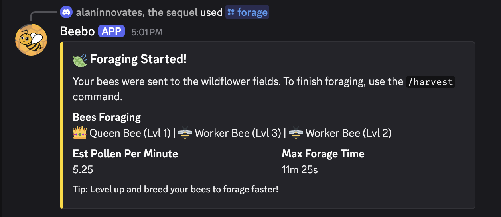
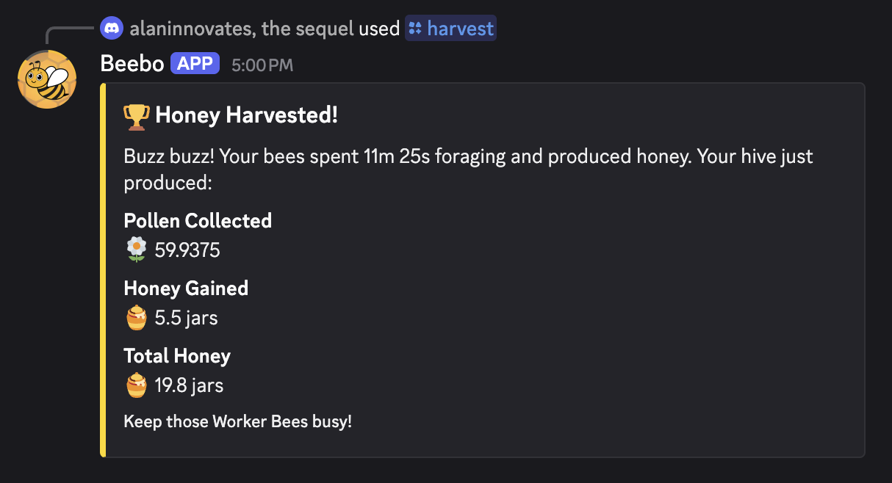
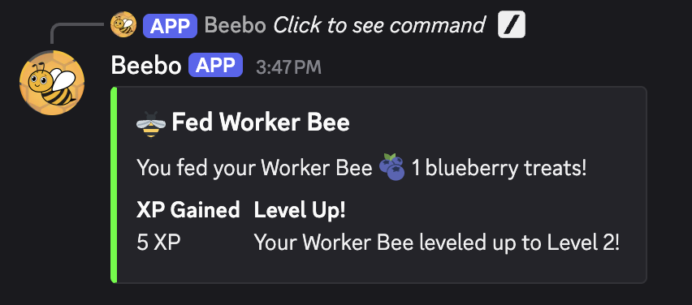
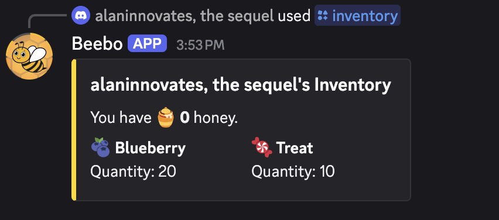
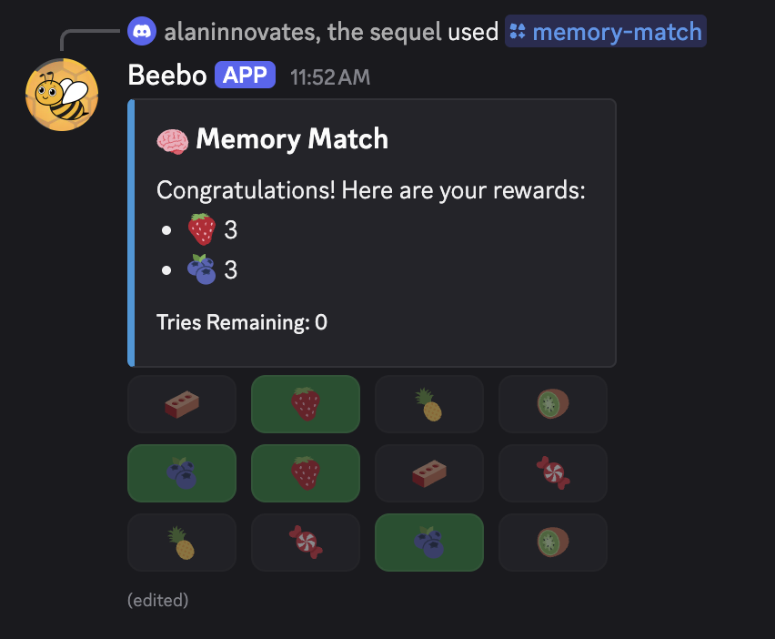

# 🐝 Beebo Discord Bot

Beebo is a fun interactive gameplay Discord bot, where the premise is to manage a bee hive. Build your hive, breed bees, farm pollen, and harvest honey!

There are plenty of bees to explore, each with unique traits and abilities. Compete in a leaderboard and try to become the richest player 🍯!

## Features
- Collect and breed bees
- Farm pollen and harvest honey
- Expand your hive
- Compete! (on a global leaderboard)

## Screenshots
...because no README would be complete without these
<table>
    <tr>
        <td>
            
            
Forage Pollen

        </td>
        <td>
            
            
Harvest Honey

        </td>
    </tr>
    <tr>
        <td>
            
            
Feed Bees

        </td>
        <td>
            
            
View your Inventory

        </td>
    </tr>
    <tr>
        <td colspan="2" align="center">
            
            
Play memory match!

        </td>
    </tr>
</table>

## Tech Stack
- Node.js
- TypeScript
- Discord.js (v14)
- Sapphire
- MongoDB
